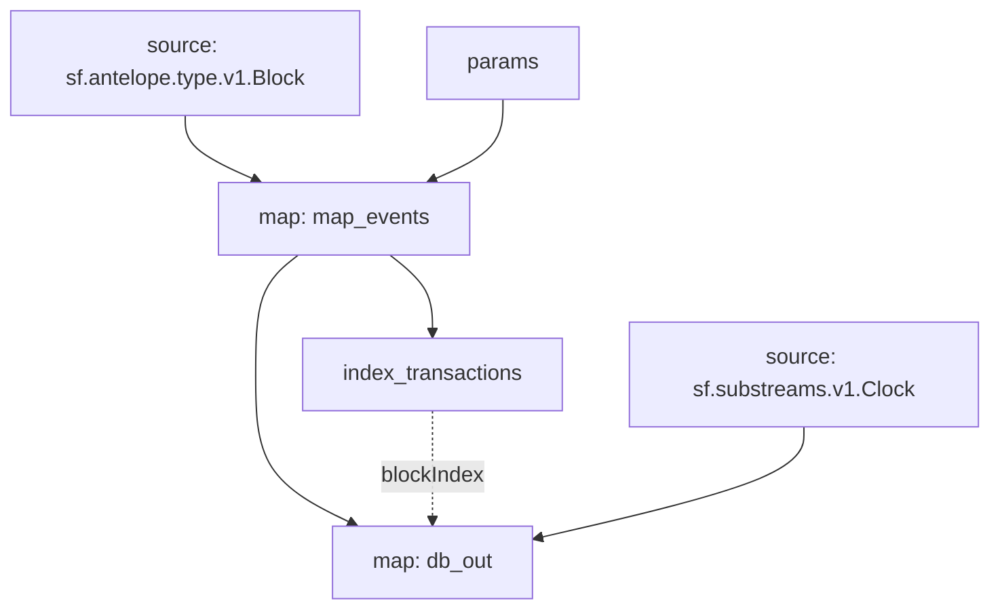

# EOS RAM Substreams

> Substreams for EOS RAM.

## Quickstart

```
$ gh repo clone pinax-network/substreams-eos-ram
$ cd substreams-eos-ram
$ make
$ make gui
```

## Releases

- https://github.com/pinax-network/substreams-eos-ram/releases

### Mermaid Graph




### Modules

```yaml
Package name: eos_ram
Version: v0.1.0
Doc: Antelope EOS RAM based action traces & database operations.
Modules:
----
Name: index_transactions
Initial block: 0
Kind: index
Input: map: map_events
Output Type: proto:sf.substreams.index.v1.Keys
Hash: f648e1cd2a58658dd572939bafa5f3ade5beb76a

Name: map_events
Initial block: 0
Kind: map
Input: params: eosio::buyram
Input: source: sf.antelope.type.v1.Block
Output Type: proto:sf.antelope.type.v1.ActionTraces
Hash: b42c67e32310fd143c5ed49502de01b2d1ff4979

Name: db_out
Initial block: 0
Kind: map
Input: source: sf.substreams.v1.Clock
Input: map: map_events
Block Filter: (using *index_transactions*): `&{eos-ram}`
Output Type: proto:sf.substreams.sink.database.v1.DatabaseChanges
Hash: 40cc7b09a508f476a1e2fa8d28a36b759850b62f
```
