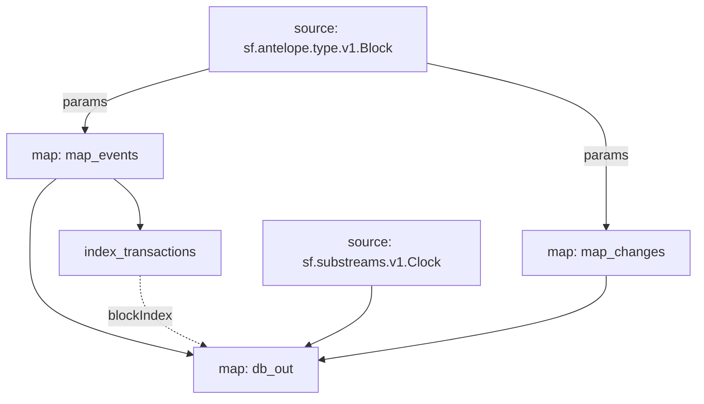

# EOS RAM Substreams

> Substreams for EOS RAM.

## Quickstart

```
$ gh repo clone pinax-network/substreams-eos-ram
$ cd substreams-eos-ram
$ make
$ make gui
```

## Releases

- https://github.com/pinax-network/substreams-eos-ram/releases

### Mermaid Graph



### Protobuf

https://github.com/pinax-network/firehose-antelope/blob/develop/proto/sf/antelope/type/v1/type.proto

```protobuf
message ActionTrace {
  string receiver = 11;
  ActionReceipt receipt = 1;
  Action action = 2;
  bool context_free = 3;
  int64 elapsed = 4;
  string console = 5;
  string transaction_id = 6;
  uint64 block_num = 7;
  string producer_block_id = 8;
  google.protobuf.Timestamp block_time = 9;
  repeated AccountRAMDelta account_ram_deltas = 10;

  // AccountDiskDeltas has been added in EOSIO 2.1.x for DISK resource (which is not part of the release oddly)
  // this has not (yet) made it into leap
  // repeated AccountDelta account_disk_deltas = 40;
  reserved 40;

  // ReturnValue has been added in EOSIO 2.1.x as something that can be returned from the execution
  // of an action.
  //
  // See https://github.com/EOSIO/eos/pull/8327
  bytes raw_return_value = 41;
  string json_return_value = 42;

  Exception exception = 15;
  uint64 error_code = 20; // https://github.com/EOSIO/eos/pull/7108
  uint32 action_ordinal = 16;
  uint32 creator_action_ordinal = 17;
  uint32 closest_unnotified_ancestor_action_ordinal = 18;
  uint32 execution_index = 19;

  // Whether this action trace was a successful match, present only when filtering was applied on block. This
  // will be `true` if the Block `filtering_applied` is `true`, if the include CEL filter matched and
  // if the exclude CEL filter did NOT match.
  bool filtering_matched = 30;

  // Whether this action trace was a successful system match, present only when filtering was applied on block.
  // This will be `true` if the Block `filtering_applied` is `true`, if the system actions include CEL filter
  // matched, supersedes any exclude CEL filter.
  bool filtering_matched_system_action_filter = 31;
}

message DBOp {
  Operation operation = 1;
  uint32 action_index = 2;
  string code = 3;
  string scope = 4;
  string table_name = 5;
  string primary_key = 6;
  string old_payer = 7;
  string new_payer = 8;
  bytes old_data = 9;
  bytes new_data = 10;
  string old_data_json = 11;
  string new_data_json = 12;

  enum Operation {
    OPERATION_UNKNOWN = 0;
    OPERATION_INSERT = 1;
    OPERATION_UPDATE = 2;
    OPERATION_REMOVE = 3;
  }
}
```

### Modules

```yaml
Package name: eos_ram
Version: v0.1.0
Doc: Antelope EOS RAM based action traces & database operations.
Modules:
----
Name: index_transactions
Initial block: 0
Kind: index
Input: map: map_events
Output Type: proto:sf.substreams.index.v1.Keys
Hash: f3e1e6a535498780fcb516a793ff1e2f8e570f29

Name: map_events
Initial block: 0
Kind: map
Input: params:
Input: source: sf.antelope.type.v1.Block
Output Type: proto:sf.antelope.type.v1.ActionTraces
Hash: 2faa843cf22a54383cc849194d58b51464f64595

Name: map_changes
Initial block: 0
Kind: map
Input: params:
Input: source: sf.antelope.type.v1.Block
Output Type: proto:sf.antelope.type.v1.DBOps
Hash: b47d817b9ea595ac81cb5aab5965224e064a6800

Name: db_out
Initial block: 0
Kind: map
Input: source: sf.substreams.v1.Clock
Input: map: map_events
Input: map: map_changes
Block Filter: (using *index_transactions*): `&{eos-ram}`
Output Type: proto:sf.substreams.sink.database.v1.DatabaseChanges
Hash: 2b53a2e7669b789babda7e96ee60ab5679539ee5

Sink config:
----
type: sf.substreams.sink.sql.v1.Service
configs:
- schema: (1991 bytes) MD5SUM: d026144c1ce34c2699532ae6b858bb61 [LOADED_FILE]
- dbt_config:
  - files: (empty) [ZIPPED_FOLDER]
  - run_interval_seconds: 0
  - enabled: false
- wire_protocol_access: false
- hasura_frontend:
  - enabled: false
- postgraphile_frontend:
  - enabled: false
- pgweb_frontend:
  - enabled: false
- engine: 2
```
