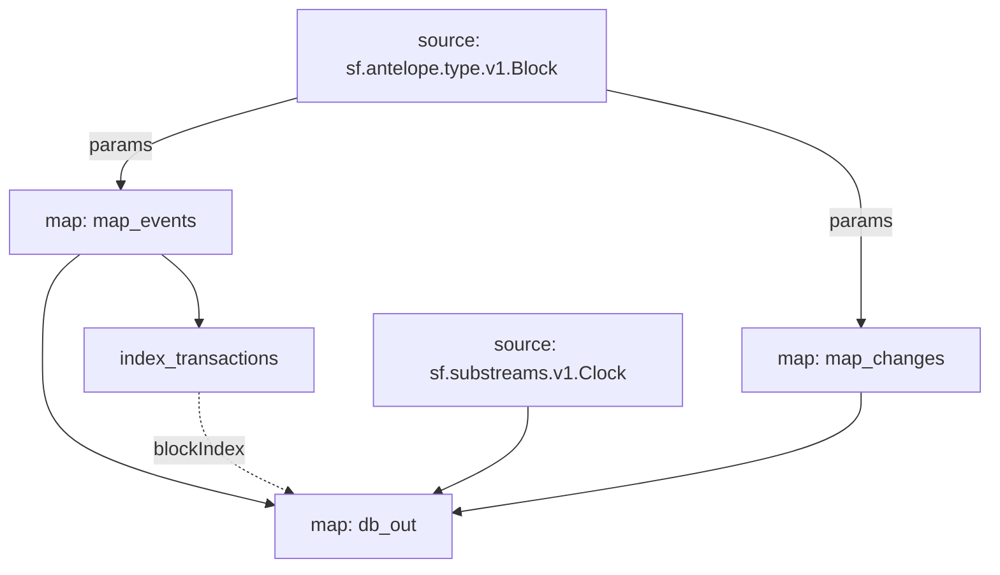

# EOS RAM Substreams

> Substreams for EOS RAM.

## Quickstart

```
$ gh repo clone pinax-network/substreams-eos-ram
$ cd substreams-eos-ram
$ make
$ make gui
```

## Releases

- https://github.com/pinax-network/substreams-eos-ram/releases

### Mermaid Graph




### Modules

```yaml
Package name: eos_ram
Version: v0.1.0
Doc: Antelope EOS RAM based action traces & database operations.
Modules:
----
Name: index_transactions
Initial block: 0
Kind: index
Input: map: map_events
Output Type: proto:sf.substreams.index.v1.Keys
Hash: 6af15ebe31fbfecbca588de0205dff01e992d881

Name: map_events
Initial block: 0
Kind: map
Input: params:
Input: source: sf.antelope.type.v1.Block
Output Type: proto:sf.antelope.type.v1.ActionTraces
Hash: b499352883d27d655b94e12c6ca9d37a9d82a765

Name: map_changes
Initial block: 0
Kind: map
Input: params:
Input: source: sf.antelope.type.v1.Block
Output Type: proto:sf.antelope.type.v1.DBOps
Hash: 66cd5720c24787507643370eeccc865df1badefd

Name: db_out
Initial block: 0
Kind: map
Input: source: sf.substreams.v1.Clock
Input: map: map_events
Input: map: map_changes
Block Filter: (using *index_transactions*): `&{eos-ram}`
Output Type: proto:sf.substreams.sink.database.v1.DatabaseChanges
Hash: 27efc8d86cd489e1f997385a3d99e6a76638f03f

Sink config:
----
type: sf.substreams.sink.sql.v1.Service
configs:
- schema: (1210 bytes) MD5SUM: 5ea112db72fa88cd8a258c7bff3250db [LOADED_FILE]
- dbt_config:
  - files: (empty) [ZIPPED_FOLDER]
  - run_interval_seconds: 0
  - enabled: false
- wire_protocol_access: false
- hasura_frontend:
  - enabled: false
- postgraphile_frontend:
  - enabled: false
- pgweb_frontend:
  - enabled: false
- engine: 2
```
